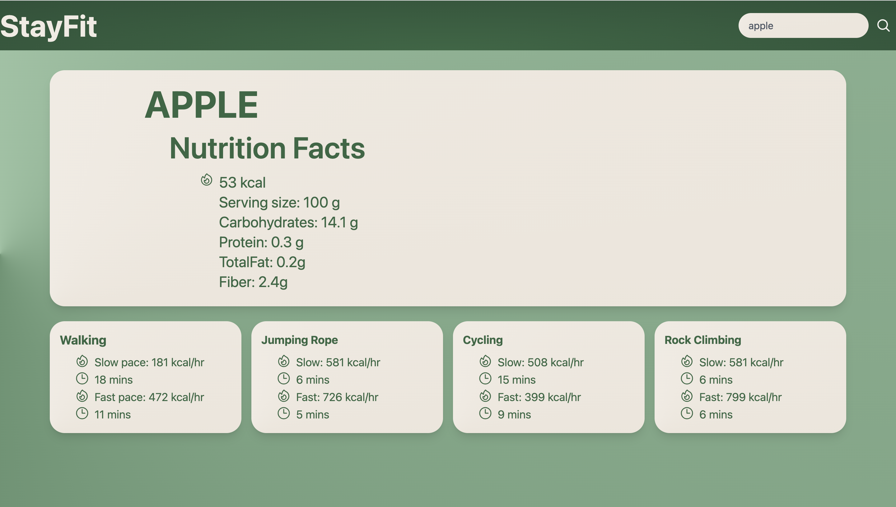

# StayFit 🏋️‍♂️🍏

| *Category*           | *Details*                                              |
|-----------------------|----------------------------------------------------------|
| *Description*       | StayFit is a web application designed to help users keep track of the calories in their meals and receive tailored exercise recommendations to burn those calories. Whether you're looking to maintain, lose, or gain weight, StayFit provides a simple yet effective approach to achieving your fitness goals. |
| *Features 🌟*       | - *Search Nutrition Facts:* Find detailed nutritional information for a wide variety of foods.   - *Exercise Recommendations:* Receive specific exercise recommendations based on your calorie intake.   - *Adjustable Intensity Levels:* Choose from various exercise intensity levels to match your comfort and fitness level.   - *User-friendly Interface:* A sleek and intuitive design that enhances the user experience. |
| *Screenshots 🖼️*   |                                                          |
| *Getting Started 🚀| 1. **Clone the repository:* `git@github.com:Andatax/StayFit.git`   2. *Navigate to the directory:* `cd StayFit`   |
| Deployed app | (https://andatax.github.io/StayFit/)   |
| *License 📜*       | This project is licensed under the MIT License. See the [LICENSE.md](./LICENSE.md) file for details. |
| *Acknowledgements 👏* | Special thanks to all the open-source libraries and tools that made this project possible! |

## Technology Used

- *JavaScript (JS):* The primary scripting language used for building the interactive functionalities of the StayFit app. JavaScript handles DOM manipulations, event handling, API fetch operations, data calculations, and local storage operations.

- *jQuery:* A JavaScript library that simplifies the process of manipulating the Document Object Model (DOM), handling events, and performing animations. The app's code frequently utilizes jQuery for accessing and manipulating DOM elements.

- *Fetch API:* Used for making network requests to retrieve data. In the StayFit app, the Fetch API is leveraged to make GET requests to the api-ninjas nutrition and exercise endpoints.

- *APIs (Application Programming Interfaces):*
  - *api-ninjas Nutrition API:* Provides nutritional facts for a given food item. The app queries this API to display the calories, carbohydrates, proteins, fats, and fiber content of a specific food.
  - *api-ninjas Calories Burned API:* Provides information on the calories burned for various activities. This API is used to display how many calories are burned for activities like walking, jumping rope, cycling, etc., based on the calories of the consumed food.

- *Local Storage:* A web storage solution that allows the app to persist data in the user's browser. The StayFit app uses local storage to save and retrieve data related to the main card and activities, allowing users to see their previously searched data even after refreshing the page.

- *Event Listeners:* JavaScript event listeners are attached to specific DOM elements to handle user interactions. For instance, the StayFit app uses event listeners to detect when the search button is clicked, when the 'Enter' key is pressed in the search input, and when the page content is fully loaded.

- *Animations:* The app incorporates animations for displaying modals. These animations are managed using CSS classes that get added or removed using jQuery, providing a more engaging user experience.

The StayFit app, through its combination of JavaScript, jQuery, Fetch API, external APIs, local storage, event listeners, and animations, provides a comprehensive solution for users to understand their food's nutritional value and how to compensate for it through various physical activities.

